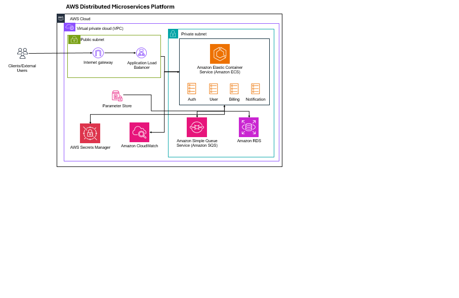

# AWS Microservices Platform (XYZ Corporation)

This repository contains a **complete, executable** implementation of the microservices platform aligned to the reference materials in `systemoverview.zip`.

## Services
- **auth-service** (ALB route prefix: `/auth`)
- **user-service** (ALB route prefix: `/users`)
- **billing-service** (ALB route prefix: `/billing`)
- **notification-service** (ALB route prefix: `/notify`)

## Alignment to Reference Spec
From `systemoverview/service-deployment-spec.md`:
- **Base image:** Amazon Linux 2
- **Runtime:** Node.js 20
- **Health checks:** `/health`
- **Env vars:** `DB_ENDPOINT`, `SQS_QUEUE_URL`, `LOG_LEVEL`, `ENVIRONMENT`

This repo matches the spec and also implements `/<prefix>/health` so external ALB path routing remains functional.

---

## Architecture



**Routing model:**
- ALB listener rules forward `/auth/*`, `/users/*`, `/billing/*`, `/notify/*` to the respective ECS services.
- Each container exposes:
  - `/health` (target group health checks)
  - `/<prefix>/health` (validation via ALB path rules)

---

# Prerequisites

- AWS CLI v2
- Docker with Buildx enabled
- An ACM certificate in the same region as the stack

Set shell variables:

```bash
export AWS_REGION="us-east-1"     # set to your region
export ENV="dev"                  # dev or staging
export STACK_NAME="$ENV-microservices-platform"
export ACCOUNT_ID="$(aws sts get-caller-identity --query Account --output text)"
```

```
$Env:AWS_REGION = "us-east-1"
$Env:ENV = "dev"
$Env:STACK_NAME = "$($Env:ENV)-microservices-platform"
$Env:ACCOUNT_ID = $(aws sts get-caller-identity --query Account --output text)
```


---

# Step 1 — Deploy CloudFormation

Infrastructure template:
- `cloudformation/microservicesplatform.yaml` ✅ (note: **services** plural)

Validate:

```bash
aws cloudformation validate-template \
  --region "$AWS_REGION" \
  --template-body file://cloudformation/microservicesplatform.yaml
```

Deploy (**required parameters included**):

```bash
aws cloudformation deploy \
  --region "$AWS_REGION" \
  --stack-name "$STACK_NAME" \
  --template-file cloudformation/microservicesplatform.yaml \
  --capabilities CAPABILITY_NAMED_IAM \
  --parameter-overrides \
    EnvironmentName="$ENV" \
    AcmCertificateArn="arn:aws:acm:$AWS_REGION:$ACCOUNT_ID:certificate/REPLACE_ME" \
    DbPassword="REPLACE_WITH_STRONG_PASSWORD"
```

Wait:

```bash
aws cloudformation wait stack-create-complete \
  --region "$AWS_REGION" \
  --stack-name "$STACK_NAME"
```

Capture ALB DNS name:

```bash
export ALB_DNS="$(aws cloudformation describe-stacks \
  --region "$AWS_REGION" \
  --stack-name "$STACK_NAME" \
  --query 'Stacks[0].Outputs[?OutputKey==`AlbDnsName`].OutputValue' \
  --output text)"

echo "ALB: $ALB_DNS"
```

---

# Step 2 — Build & Push Images to ECR

CloudFormation creates ECR repos:
- `$ENV/auth-service`
- `$ENV/user-service`
- `$ENV/billing-service`
- `$ENV/notification-service`

## 2.1 Login to ECR

```bash
aws ecr get-login-password --region "$AWS_REGION" \
  | docker login --username AWS --password-stdin \
    "$ACCOUNT_ID.dkr.ecr.$AWS_REGION.amazonaws.com"
```

## 2.2 Enable Buildx (recommended)

```bash
docker buildx create --name multiarch --use 2>/dev/null || docker buildx use multiarch
docker buildx inspect --bootstrap
```

## 2.3 Build + Push (multi-arch)

> ECS/Fargate commonly pulls `linux/amd64`. Building multi-arch prevents `CannotPullContainerError` on Apple Silicon.

```bash
export TAG="latest"
ECR="$ACCOUNT_ID.dkr.ecr.$AWS_REGION.amazonaws.com"

for svc in auth-service user-service billing-service notification-service; do
  docker buildx build --platform linux/amd64,linux/arm64 \
    -t "$ECR/$ENV/$svc:$TAG" \
    --push ./services/$svc

done
```

---

# Step 3 — Update ECS Services to Use the Image Tags

If you pushed images after stack creation (or changed tags), re-deploy the stack with image tag parameters:

```bash
aws cloudformation deploy \
  --region "$AWS_REGION" \
  --stack-name "$STACK_NAME" \
  --template-file cloudformation/microservicesplatform.yaml \
  --capabilities CAPABILITY_NAMED_IAM \
  --parameter-overrides \
    EnvironmentName="$ENV" \
    AcmCertificateArn="arn:aws:acm:$AWS_REGION:$ACCOUNT_ID:certificate/REPLACE_ME" \
    DbPassword="REPLACE_WITH_STRONG_PASSWORD" \
    AuthImageTag="$TAG" \
    UserImageTag="$TAG" \
    BillingImageTag="$TAG" \
    NotificationImageTag="$TAG"
```

---

# Step 4 — Validate Routing + Health

Validate each service through ALB path rules:

```bash
curl -sk "https://$ALB_DNS/auth/health" | cat
curl -sk "https://$ALB_DNS/users/health" | cat
curl -sk "https://$ALB_DNS/billing/health" | cat
curl -sk "https://$ALB_DNS/notify/health" | cat
```

Expected: HTTP 200 and JSON payload with `status: ok`.

---

# Security & Compliance Notes

- Secrets are stored in **AWS Secrets Manager** and encrypted with a **customer-managed KMS key** (`SecretsKmsKey`).
- CloudWatch log groups are encrypted using **LogsKmsKey** via `KmsKeyId`.
- ECS tasks use scoped IAM permissions for:
  - `secretsmanager:GetSecretValue` (DB secret)
  - `kms:Decrypt` / `kms:DescribeKey` (SecretsKmsKey and LogsKmsKey)
  - `ssm:GetParametersByPath` (platform config path)
  - `sqs:*` limited to the platform queues

---

# Troubleshooting

## CannotPullContainerError (platform linux/amd64)
Rebuild and push multi-arch images using Buildx (Step 2.2 + 2.3).

## ALB returns 404
- Confirm you are calling a valid prefix route: `/auth/*`, `/users/*`, `/billing/*`, `/notify/*`.
- Confirm the target ECS service is healthy in its target group.

